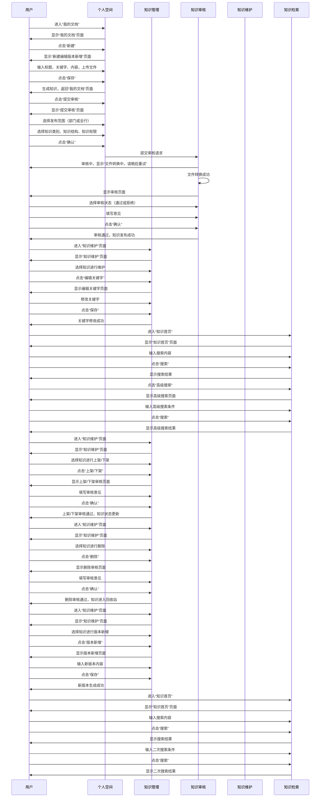
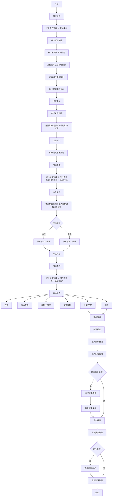

# mermaid

```mermaid 
sequenceDiagram
    participant 用户
    participant 个人空间
    participant 知识管理
    participant 知识审核
    participant 知识维护
    participant 知识检索

    %% 知识新建
    用户->>个人空间: 进入“我的文档”
    个人空间->>用户: 显示“我的文档”页面
    用户->>个人空间: 点击“新建”
    个人空间->>用户: 显示“新建编辑版本新增”页面
    用户->>个人空间: 输入标题、关键字、内容，上传文件
    用户->>个人空间: 点击“保存”
    个人空间->>用户: 生成知识，返回“我的文档”页面

    %% 提交审核
    用户->>个人空间: 点击“提交审核”
    个人空间->>用户: 显示“提交审核”页面
    用户->>个人空间: 选择发布范围（部门或全行）
    用户->>个人空间: 选择知识类别、知识结构、知识权限
    用户->>个人空间: 点击“确认”
    个人空间->>知识审核: 提交审核请求
    知识审核->>用户: 审核中，显示“文件转换中，请稍后重试”

    %% 知识审核（发布）
    知识审核->>知识审核: 文件转换成功
    知识审核->>用户: 显示审核页面
    用户->>知识审核: 选择审核状态（通过或拒绝）
    用户->>知识审核: 填写意见
    用户->>知识审核: 点击“确认”
    知识审核->>用户: 审核通过，知识发布成功

    %% 知识维护
    用户->>知识管理: 进入“知识维护”页面
    知识管理->>用户: 显示“知识维护”页面
    用户->>知识管理: 选择知识进行维护
    用户->>知识管理: 点击“编辑关键字”
    知识管理->>用户: 显示编辑关键字页面
    用户->>知识管理: 修改关键字
    用户->>知识管理: 点击“保存”
    知识管理->>用户: 关键字修改成功

    %% 知识检索
    用户->>知识检索: 进入“知识首页”
    知识检索->>用户: 显示“知识首页”页面
    用户->>知识检索: 输入搜索内容
    用户->>知识检索: 点击“搜索”
    知识检索->>用户: 显示搜索结果
    用户->>知识检索: 点击“高级搜索”
    知识检索->>用户: 显示高级搜索页面
    用户->>知识检索: 输入高级搜索条件
    用户->>知识检索: 点击“搜索”
    知识检索->>用户: 显示高级搜索结果

    %% 知识维护 - 上架/下架
    用户->>知识管理: 进入“知识维护”页面
    知识管理->>用户: 显示“知识维护”页面
    用户->>知识管理: 选择知识进行上架/下架
    用户->>知识管理: 点击“上架/下架”
    知识管理->>用户: 显示上架/下架审核页面
    用户->>知识管理: 填写审核意见
    用户->>知识管理: 点击“确认”
    知识管理->>用户: 上架/下架审核通过，知识状态更新

    %% 知识维护 - 删除
    用户->>知识管理: 进入“知识维护”页面
    知识管理->>用户: 显示“知识维护”页面
    用户->>知识管理: 选择知识进行删除
    用户->>知识管理: 点击“删除”
    知识管理->>用户: 显示删除审核页面
    用户->>知识管理: 填写审核意见
    用户->>知识管理: 点击“确认”
    知识管理->>用户: 删除审核通过，知识进入回收站

    %% 知识维护 - 版本新增
    用户->>知识管理: 进入“知识维护”页面
    知识管理->>用户: 显示“知识维护”页面
    用户->>知识管理: 选择知识进行版本新增
    用户->>知识管理: 点击“版本新增”
    知识管理->>用户: 显示版本新增页面
    用户->>知识管理: 输入新版本内容
    用户->>知识管理: 点击“保存”
    知识管理->>用户: 新版本生成成功

    %% 知识检索 - 二次搜索
    用户->>知识检索: 进入“知识首页”
    知识检索->>用户: 显示“知识首页”页面
    用户->>知识检索: 输入搜索内容
    用户->>知识检索: 点击“搜索”
    知识检索->>用户: 显示搜索结果
    用户->>知识检索: 输入二次搜索条件
    用户->>知识检索: 点击“搜索”
    知识检索->>用户: 显示二次搜索结果
```

```mermaid 
graph TD
    A[开始] --> B[知识新建]
    B --> B1[进入个人空间 -> 我的文档]
    B1 --> B2[点击新建按钮]
    B2 --> B3[输入标题关键字内容]
    B3 --> B4[上传文件生成附件列表]
    B4 --> B5[点击保存生成知识]
    B5 --> B6[返回我的文档页面]

    B6 --> C[提交审核]
    C --> C1[选择发布范围]
    C1 --> C2[选择知识类别知识结构知识权限]
    C2 --> C3[点击确认]
    C3 --> C4[知识进入审核流程]

    C4 --> D[知识审核]
    D --> D1[进入知识管理 -> 全行库管理/部门库管理 -> 知识审核]
    D1 --> D2[点击审核]
    D2 --> D3[查看知识类别知识结构知识权限等数据]
    D3 --> D4{审核状态}
    D4 -->|通过| D5[填写意见并确认]
    D4 -->|拒绝| D6[填写意见并确认]
    D5 --> D7[审核完成]
    D6 --> D7[审核完成]

    D7 --> E[知识维护]
    E --> E1[进入知识管理 -> 部门库管理 -> 知识维护]
    E1 --> E2[选择操作]
    E2 --> E3[打开]
    E2 --> E4[版本查看]
    E2 --> E5[编辑关键字]
    E2 --> E6[纠错编辑]
    E2 --> E7[上架/下架]
    E2 --> E8[删除]
    E7 --> E9[审核通过]
    E8 --> E9[审核通过]

    E9 --> F[知识检索]
    F --> F1[进入知识首页]
    F1 --> F2[输入内容搜索]
    F2 --> F3{是否高级搜索?}
    F3 -->|是| F4[选择搜索模式]
    F4 --> F5[输入搜索条件]
    F5 --> F6[点击搜索]
    F3 -->|否| F6[点击搜索]
    F6 --> F7[显示搜索结果]
    F7 --> F8{是否排序?}
    F8 -->|是| F9[选择排序方式]
    F9 --> F10[显示排序结果]
    F8 -->|否| F10[显示默认结果]

    F10 --> G[结束]
```